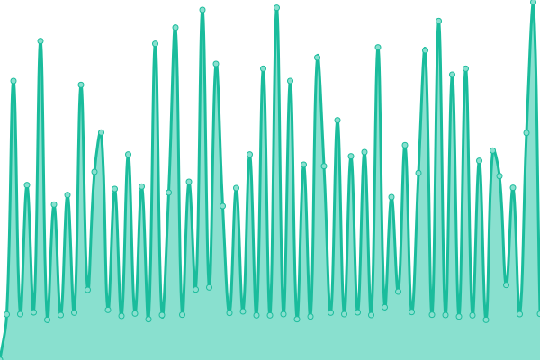
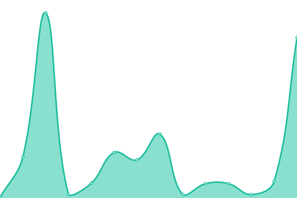
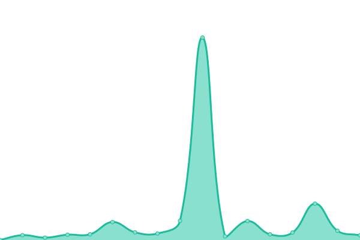

# [📈 Live Status](https://Suns2794.github.io/ariaxa-upptime): <!--live status--> **🟧 Partial outage**

This repository contains the open-source uptime monitor and status page for [Suns2794](https://Suns2794.github.io/ariaxa-upptime), powered by [Upptime](https://github.com/upptime/upptime).

With [Upptime](https://upptime.js.org), you can get your own unlimited and free uptime monitor and status page, powered entirely by a GitHub repository. We use [Issues](https://github.com/Suns2794/ariaxa-upptime/issues) as incident reports, [Actions](https://github.com/Suns2794/ariaxa-upptime/actions) as uptime monitors, and [Pages](https://Suns2794.github.io/ariaxa-upptime) for the status page.

<!--start: status pages-->
<!-- This summary is generated by Upptime (https://github.com/upptime/upptime) -->
<!-- Do not edit this manually, your changes will be overwritten -->
<!-- prettier-ignore -->
| URL | Status | History | Response Time | Uptime |
| --- | ------ | ------- | ------------- | ------ |
|  [Ariaxa Web](https://web.ariaxa.com) | 🟩 Up | [ariaxa-web.yml](https://github.com/Suns2794/ariaxa-upptime/commits/HEAD/history/ariaxa-web.yml) | 

 7189ms
     
 | 

<a href="https://Suns2794.github.io/ariaxa-upptime/history/ariaxa-web">99.58%</a>
    

|  [Ariaxa Apps](https://ariaxa.com/app-project/) | 🟥 Down | [ariaxa-apps.yml](https://github.com/Suns2794/ariaxa-upptime/commits/HEAD/history/ariaxa-apps.yml) | 

 527ms
     
 | 

<a href="https://Suns2794.github.io/ariaxa-upptime/history/ariaxa-apps">99.63%</a>
    

|  [Ariaxa SuperAdmin](https://ariaxa.com/config/login_su.php) | 🟥 Down | [ariaxa-super-admin.yml](https://github.com/Suns2794/ariaxa-upptime/commits/HEAD/history/ariaxa-super-admin.yml) | 

 65ms
     
 | 

<a href="https://Suns2794.github.io/ariaxa-upptime/history/ariaxa-super-admin">99.63%</a>
    

|  [Ariaxa Test](https://pruebas.ariaxa.com/config/login_su.php) | 🟥 Down | [ariaxa-test.yml](https://github.com/Suns2794/ariaxa-upptime/commits/HEAD/history/ariaxa-test.yml) | 

 609ms
     
 | 

<a href="https://Suns2794.github.io/ariaxa-upptime/history/ariaxa-test">43.30%</a>
    

<!--end: status pages-->

[**Visit our status website →**](https://Suns2794.github.io/ariaxa-upptime)

## 📄 License

- Powered by: [Upptime](https://github.com/upptime/upptime)
- Code: [MIT](./LICENSE) © [Anand Chowdhary](https://anandchowdhary.com), supported by [Pabio](https://pabio.com)
- Data in the `./history` directory: [Open Database License](https://opendatacommons.org/licenses/odbl/1-0/)
